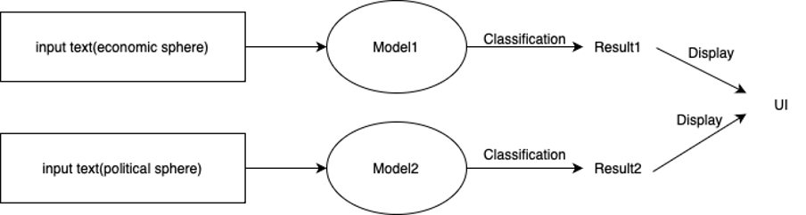
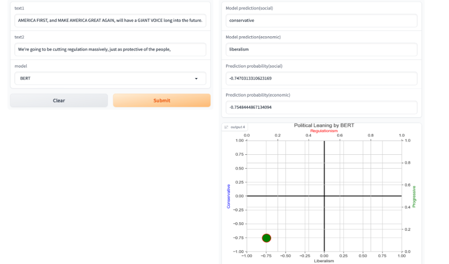
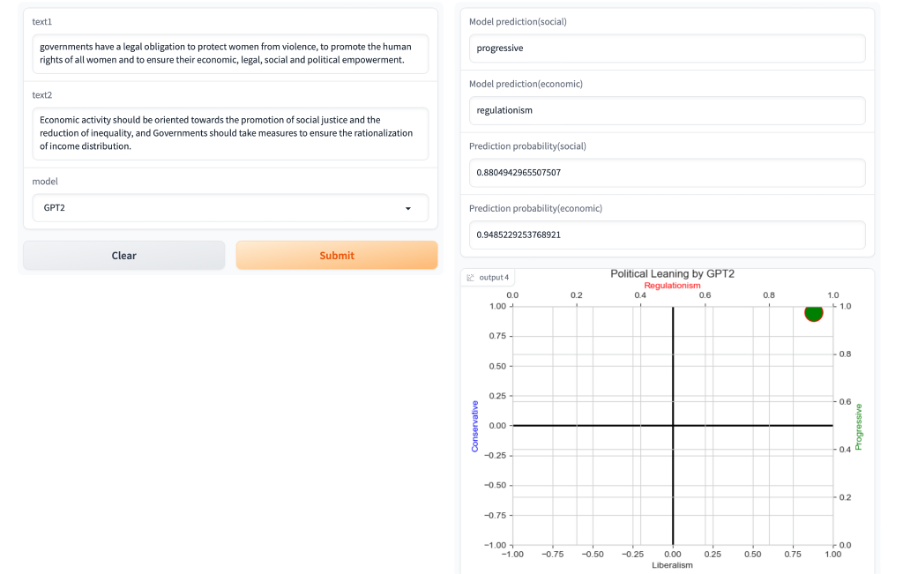
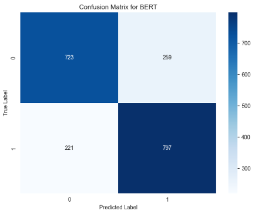
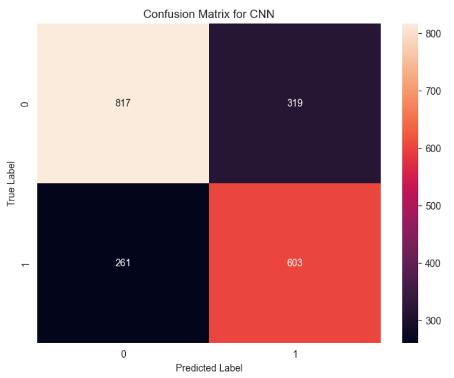

# PolitiTrend

## Introduction
PolitiTrend leverages natural language processing techniques to predict the political stance of text messages. Inspired by ideology tests, it classifies text into economic (regulationism, liberalism) and political-cultural (progressivism, conservatism) spheres.

## Demo

## Data Processing
Data sourced from [Manifesto Project](https://manifesto-project.wzb.eu/), categorized into four political stances. We implemented data pre-processing steps like lemmatization, stopword, and punctuation removal.

## Results
Our models demonstrate high accuracy but face challenges like misclassification, misuse of softmax outputs, and handling neutral statements. We discuss strategies to overcome these.

 

## Individual Contribution
**Feifan Li:**

Responsible for Collecting and preprocessing the PolitiTrend dataset. 

Responsible for categorizing these labels into four categories

Responsible for fine-tuning the ‘TFBertForSequenceClassification’ BERT model

Responsible for training the ‘GPT2’ model used for classification

Responsible for Qualitative Analysis of Model performance 

Responsible for Gradio implementation

Responsible for the final report

**Ge Jin:**

Responsible for categorizing these labels into four categories 

Responsible for constructing the baseline model  and selecting the best parameters 

Responsible for training the ‘GPT2’ model used for classification

Responsible for Gradio implementation

Responsible for Quantitative Analysis of Model performance 

Responsible for the final report

## License & Permissions
Permission granted for posting the final report and source code.

